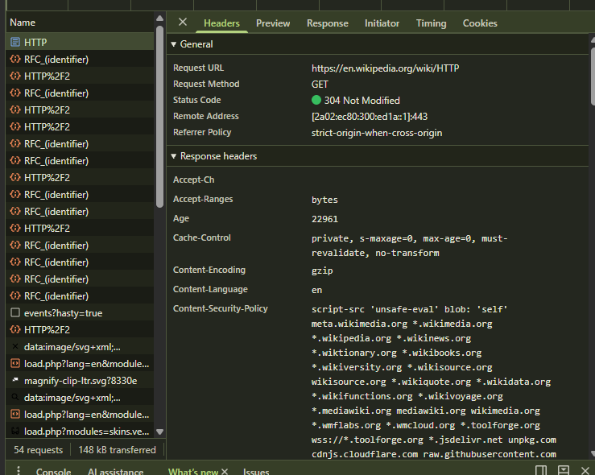
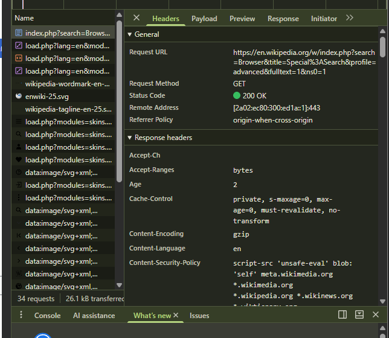

  

**МОЛДАВСКИЙ ГОСУДАРСТВЕННЫЙ УНИВЕРСИТЕТ**

**ФАКУЛЬТЕТ МАТЕМАТИКИ И ИНФОРМАТИКИ**

**ДЕПАРТАМЕНТ ИНФОРМАТИКИ**

      

# Лабораторная работа №1

  

## HTTP

    
  

Проверил: Б. Вишневский

Выполнил: Д. Белов

    

**Кишинёв – 2026 г.**

    
---
# Задание 1

Заходим на сайт Википедиа, переходим в инструменты разработчика, переходим во вкладку Network, обновляем сайт.

Первым запросом является HTTP:
- **URL**: https://en.wikipedia.org/wiki/HTTP
- **Метод**: `GET` (GET необходим для получения ресурсов с сервера)
- **Статус ответа**: `304 Not Modified` (означает, что запрашиваемый ресурс не менялся, что экономит трафик и ускоряет загрузку)
- **Заголовки ответа**:

|**Заголовок**|**Значение**|**Назначение**|
|---|---|---|
|**Content-Type**|text/html; charset=UTF-8|Формат ответа (HTML) и кодировка текста|
|**Content-Encoding**|gzip|Алгоритм сжатия данных при передаче|
|**Strict-Transport-Security**|max-age=...; includeSubDomains|Политика HSTS: принудительное использование HTTPS|
|**Content-Security-Policy**|script-src...; default-src...|Безопасность: ограничение источников загрузки ресурсов|
|**Last-Modified**|Wed, 09 Sep 2026...|Дата и время последнего обновления контента|
|**X-Cache**|hit-front|Указывает на выдачу страницы из CDN-кеша Wikimedia|

- **Заголовок запроса**:

| Заголовок | Значение | Назначение |
| --- | --- | --- |
| **:method** | GET | Запрос на получение ресурса без изменения состояния сервера |
| **User-Agent** | Mozilla/5.0 (Windows NT 10.0...) | Сведения о клиенте (Chrome 152, Windows) |
| **If-Modified-Since** | Wed, 09 Sep 2026 14:12:33 GMT | Условный запрос кеша (приводит к ответу 304 Not Modified) |
| **Referer** | [https://elearning.usm.md/](https://elearning.usm.md/) | Источник перехода (Moodle USM) |
| **Accept-Encoding** | gzip, deflate, br, zstd | Поддерживаемые алгоритмы сжатия данных |
| **Sec-Fetch-Mode** | navigate | Тип запроса (прямая навигация пользователя) |

- **Тело запроса**: Отсутствует (для GET запросов передача тела не предусмотрена).
- **Тело ответа**: Содержит исходный HTML код страницы Wikipedia.
- Общее число запросов составляет 53. Это число включает запросы CSS стилей, изображений, скриптов и других ресурсов.

- Проводим подобные опперации для другого сайта. Статьи по адресу https://en.wikipedia.org/wiki/HTTPdsfdfs не существует, поэтому "HTTPdsfdfs" возвращает статус код **404**, что означает ресурс не найден.

---
# Задание 2
- Выполняю поиск на сайте Википедия
- Запросом поиска являетя `index.php?search=Browser&title=Special%3ASearch&profile=advanced&fulltext=1&ns0=1` - он является главным запросом поиска и загружает основной HTML файл для построения DOM дерева страницы.
- **Полный URL**: https://en.wikipedia.org/w/index.php?search=Browser&title=Special%3ASearch&profile=advanced&fulltext=1&ns0=1
- Запрос имеет метод **GET**, так как поиск подразумевает чтение данных (их получение с сервера). Статус **200** (OK) подтверждает успех выполнения.
- **Query string parametres**:  

| Параметр | Значение | Назначение |
| --- | --- | --- |
| **search** | Browser | Основной текст поискового запроса |
| **title** | Special:Search | Системная служебная страница MediaWiki, обрабатывающая логику поиска |
| **profile** | advanced | Режим работы поискового движка (расширенный) |
| **fulltext** | 1 | Принудительный полнотекстовый поиск по статьям (без перехода на конкретную) |
| **ns0** | 1 | Ограничение поиска главным пространством статей (посик выполнен среди основных статей) |

---
# Задание 3

- Переходим на страницу Гугл и повторяем опперации.
- анализ первого запроса (из 36):  
**URL**: https://www.google.com/js/bg/fD2r805Vg3wuXjZg_Ay7LaIUMvQid2fQlNFyrS4DczI.js (путь к внешнему JavaScript файлу)  
**Request Method** - `GET`   
**Status Code** - `200 OK (from disk cache)` (так как данный JS файл был загружен ранее и всё ещё актуален согласно заголовкам кэширования, поэтому он был мгновенно прочитан из кеша компьютера)  
**Remote Address** - `142.251.151.119:443` (IP адрес сервера Гугл и порт)  
**Referrer Policy** - `origin` (политика безопасности; передача только доменным именем)
- **Response Headers**

| Заголовок | Значение | Назначение |
| --- | --- | --- |
| **`Content-Type`** | `text/javascript` | Формат файла (скрипт JavaScript) |
| **`Content-Encoding`** | `br` | Сжатие файла алгоритмом Brotli |
| **`Cache-Control`** | `public, max-age=31536000` | Долговременное кеширование ресурса на 1 год |
| **`Alt-Svc`** | `h3=":443"; ma=2592000` | Поддержка протокола HTTP/3 (QUIC) |
| **`Server`** | `sffe` | Фронтенд-сервер Google (Small Web Frontend) |
| **`Expires`** | `Thu, 02 Sep 2027...` | Срок актуальности файла в кеше |

- **Reques Headers**

| Заголовок | Значение | Назначение |
| --- | --- | --- |
| **Referer** | [https://www.google.com/](https://www.google.com/) | Страница-источник запроса |
| **User-Agent** | Mozilla/5.0 (Windows NT 10.0...) | Идентификация браузера и ОС клиента |
| **Sec-Ch-Prefers-Color-Scheme** | dark | Информация о предпочтении тёмной темы в ОС |
| **Sec-Ch-Ua-Form-Factors** | "Desktop" | Тип форм-фактора устройства (десктоп) |
| **Downlink / Rtt** | 7.85 / 200 | Метрики качества и скорости сетевого соединения |

---
# Задание 4

`User-Agent - это заголовок HTTP-запроса, содержащий текстовую строку, которая идентифицирует клиентское приложение (браузер, операционную систему, версию программы, бот или скрипт), отправляющее запрос.`
Он используется для:
1. Адаптация контента (например под разные устройства).
2. Аналитика и логирование.
3. Предоставление специфичных скриптов или стилей под конкретные браузеры, что обеспечивает совместимость.
4. Идентификация ботов и ограничение доступа автоматизированным скриптам.

### Post & GET запросы: 
- **GET запрос**  
GET / HTTP/1.1  
Host: sandbox.usm.com  
User-Agent: Daniil Belov  
Accept: */*  

- **POST запрос**  
POST /cars HTTP/1.1  
Host: sandbox.usm.com  
Content-Type: application/x-www-form-urlencoded  
Content-Length: 35    
make=Subaru&model=Forester&year=2006

### Oсновные методы HTTP-запросов

| Метод | Назначение |
| --- | --- |
| **GET** | Запрос данных с сервера (не должен изменять состояние сервера). |
| **POST** | Отправка данных на сервер для создания нового ресурса или обработки. |
| **PUT** | Полная замена или создание ресурса по указанному URI. |
| **PATCH** | Частичное обновление существующего ресурса. |
| **DELETE** | Удаление указанного ресурса с сервера. |
| **HEAD** | Аналогичен GET, но возвращает только заголовки (без тела ответа). |
| **OPTIONS** | Возвращает поддерживаемые сервером методы для указанного URI (используется для CORS). |
| **TRACE** | Выполняет петлевой тест возврата сообщения (используется для диагностики). |

### PUT запрос

- **PUT запрос**  
PUT /cars/1 HTTP/1.1  
Host: sandbox.usm.com  
User-Agent: Daniil Belov  
Content-Type: application/json  
Content-Length: 53   

  {  
  "make": "Toyota",  
  "model": "Corolla",  
  "year": 2021  
}  

- Разница между `PATCH` и `PUT` запросами  
PUT предназначен для поной замены ресурса, в то время как PATCH нужен для частичной замены ресурса.

- **Вариант ответа сервера**  
  - Запрос:     
**POST /cars HTTP/1.1** 
**Host: sandbox.com**  
**Content-Type: application/json**  
**User-Agent: John Doe**     
**model=Corolla&make=Toyota&year=2020**     

  - Ответ:  
  Скорее всего сервер вернёт **400 Bad Request** из-за несоответствия типа передаваемых данных ожидаемому типу.

### Возможные ситуации для кодов состояния: 

`200` OK - Запрос успешно обработан. (сервер принял данные и возвращает результат)

`201` Created - Новый ресурс успешно создан на сервере.

`400` Bad Request - Ошибка клиента в синтаксисе запроса. Например, несоответствие Content-Type (передача строки вместо числа в поле year).

`401` Unauthorized - Для выполнения запроса требуется аутентификация.

`403` Forbidden - Клиент аутентифицирован, но у него нет прав на добавление записей в базу данных.

`404` Not Found - Неверно указан URL адрес.

`500` Internal Server Error - Внутренняя ошибка сервера (сбой при подключении к базе данных или необработанная ошибка в коде бекенда).

---

# Вывод
В результате лабораторной работы я научился следующему:
- Анализировать HTTP запросы (определять методы, читать заголовки)
- Различать и определять методы, классифицировать их и описывать их
- Писать HTTP запросы